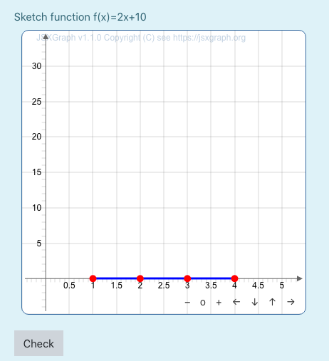

# moodleformulas_jsxgraph

The moodle plug-in [moodle question type formulas](https://moodle.org/plugins/qtype_formulas), see also <https://moodleformulas.org/>, allows to create question containing random values and multiple answer fields.
The file `jsxquestion.js` supplies the transfer of values between the formulas question and [JSXGraph](https://jsxgraph.org) constructions. 

## Installation

Download the file `src/jsxquestion.js` to the moodle installation or a public server.

## Example

